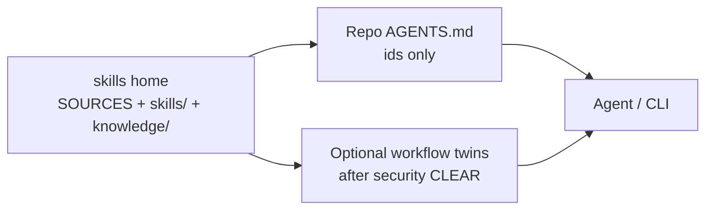

# Architecture — shared skills

Git-first skills home. Agents load procedures from `skills/<id>/`
instead of installing a second process pack. The process applies to
software, docs, and other tickets using this home; language skills are
for code.

## Problem

Shared, inspectable procedures without marketplace dumps. Two
routers in one session skip the bug. Skills are cherry-picked,
SHA-pinned, intake-scanned, and loadable by id.

## Goals

1. One **skills home** with SOURCES pins, compressed `SKILL.md` bodies,
   and knowledge distillations (`knowledge/<domain>/<kind>/`).
2. Thin **AGENTS.md** on product repos naming skill **ids** only (no body
   paste). Optional shared layout: `CHANGELOG.md`, `docs/hld.md`,
   `docs/lld.md` (see SDLC Conventions). Shapes:
   `skills/sdlc-artifacts/templates/`.
3. Role split: architect design, designer UX/stories/mockups, builder
   ship, tester CI, security intake/gates, manager board. Human accepts
   UX unless they waive.
4. Named SDLC steps (see [SDLC.md](SDLC.md)): **Entry** classifies
   chunk vs item. **Chunk** Brief is Gather ↔ Refine
   (`discover-the-idea`; do not copy that skill) then write Plan and
   Spec. **Incoming item** Brief is problem + fix vs a `yagni` removal;
   then **align** Plan and Spec. After Spec, builders keep human
   how-tos and agent-facing contracts current (`docs-google-style`).
   **Build** loops until each item is merge-ready. Groom sets board
   blockers; do not start an item that is still blocked. Land each item
   on **project-main** (or trunk if there is none); land project-main on
   trunk at **Trunk**. One clean builder and one clean verifier per work
   item; later loops **resume** those subagents. On mint, pack or point
   the prompt for token cost; do not re-pack on resume.

## Non-goals

- Marketplace `npx skills add` / auto-update upstream.
- Mirror-only design docs (a mirror may follow; git is source of truth).
- Reminting closed skill bodies without a new **security** cut.
- Personal finance, mail, password stores, or extra hosts outside the
  workspace in agent scope.

## Layers

| Layer | What | Where |
| --- | --- | --- |
| Skills home | First-party `SKILL.md` + pins; distillations under `knowledge/` | this repo |
| Project contract | Commands + skill ids | Root `AGENTS.md` per product repo |
| Workers | Implement via remote agent or local CLI | PR / local box |
| Board | Projects / Epics / Tasks | Issue tracker |

## Roles

| Role | Boundary |
| --- | --- |
| architect | HLD/LLD, ship shape, adversarial review |
| designer | Stories, high-level UX, Spec mockups when there is a screen |
| builder | Implement behind Always |
| tester | fmt/lint/CI green, PR watch |
| security | Intake, Always/Ask/Never, scanners |
| manager | After-act; land path; does not bless ships |
| operator | HITL, vuln severity, extra-host exceptions |

## Risks

| Risk | Mitigation |
| --- | --- |
| Board lag vs `gh` | `gh` wins; after-act with the operator timezone |
| Scanner false positives on Never examples | Oblique wording (shell-safety pattern) |
| Dual routers | Load this repo’s ids only; do not install a second process pack |
| Empty remote sandbox | Degrade to `gh`; do not remint |

## References

- [SDLC.md](SDLC.md)
- [INTAKE.md](INTAKE.md)
- [SOURCES.md](../SOURCES.md)
- [LICENSE](../LICENSE) / [NOTICE](../NOTICE)
- [CHERRY-PICK-CANDIDATES.md](CHERRY-PICK-CANDIDATES.md)
- [knowledge/README.md](../knowledge/README.md)
