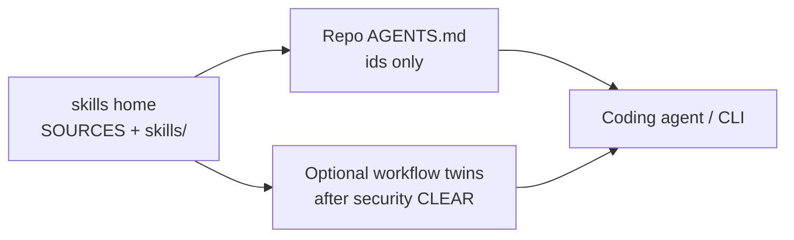

# Architecture — shared coding skills

Git-first skills home. Coding agents load procedures from `skills/<id>/`
instead of installing mega-packs (Superpowers / Pocock / Addy whole).

## Problem

Shared, inspectable coding procedures without marketplace dumps. Two
routers in one session skip the bug. Skills are cherry-picked,
SHA-pinned, intake-scanned, and loadable by id.

## Goals

1. One **skills home** with SOURCES pins and compressed `SKILL.md` bodies.
2. Thin **AGENTS.md** on product repos naming skill **ids** only (no body
   paste).
3. Role split: architect design, builder ship, tester CI, security
   intake/gates, manager board.
4. Stage −1 → 0 → … → 7 with **Stage 4 as a loop** until each item is
   merge-ready. Land each item on **project-main** as it finishes; land
   project-main on trunk at Stage 6. One clean builder and one clean
   verifier per work item; later loops **resume** those subagents. On
   mint, pack or point the prompt for token cost; do not re-pack on
   resume.

## Non-goals

- Marketplace `npx skills add` / auto-update upstream.
- Mirror-only design docs (a mirror may follow; git is source of truth).
- Reminting closed skill bodies without a new **security** cut.
- Personal finance, mail, password stores, or extra hosts outside the
  workspace in agent scope.

## Layers

| Layer | What | Where |
| --- | --- | --- |
| Skills home | First-party `SKILL.md` + pins | this repo |
| Project contract | Commands + skill ids | Root `AGENTS.md` per product repo |
| Workers | Implement via remote agent or local CLI | PR / local box |
| Board | Projects / Epics / Tasks | Issue tracker |

## Roles (coding)

| Role | Boundary |
| --- | --- |
| architect | HLD/LLD, ship shape, adversarial review |
| builder | Implement behind Always |
| tester | fmt/lint/CI green, PR watch |
| security | Intake, Always/Ask/Never, scanners |
| manager | After-act; land path; does not bless ships |
| operator | HITL, vuln severity, extra-host exceptions |

## Risks

| Risk | Mitigation |
| --- | --- |
| Board lag vs `gh` | `gh` wins; after-act with the operator timezone |
| Scanner false positives on Never examples | Oblique wording (shell-safety pattern) |
| Dual routers | Ban managed Superpowers; load this repo’s ids only |
| Empty remote sandbox | Degrade to `gh`; do not remint |

## References

- [SDLC.md](SDLC.md)
- [INTAKE.md](INTAKE.md)
- [SOURCES.md](../SOURCES.md)
- [CHERRY-PICK-CANDIDATES.md](CHERRY-PICK-CANDIDATES.md)
