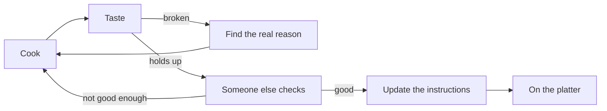
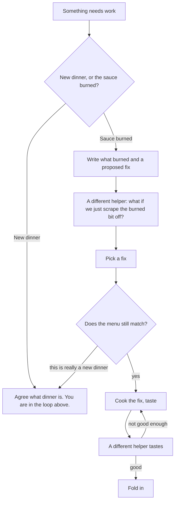
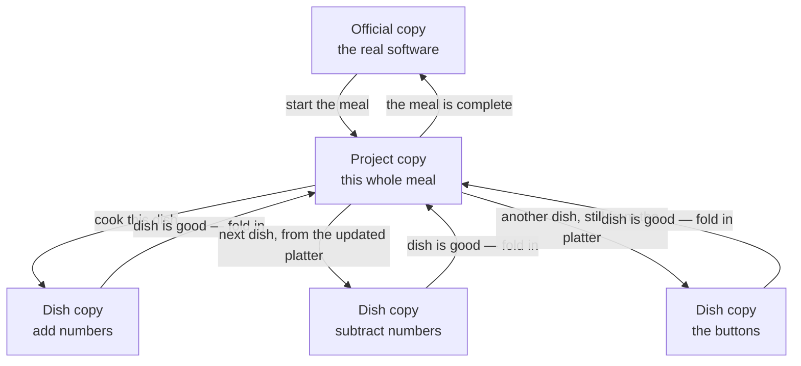

# SDLC

Shared process for work that uses this skills home. Software is the
common case; the same steps apply to docs, process changes, and other
tickets. Git holds durable artifacts. The issue tracker is the board.
Pull requests cite a ticket ID when the project uses tickets.

## Roles

Skills are **tools**, keyed by role. Improvise when the work needs it.
Do not remint a skill that already has an id here.

| Role | Job |
| --- | --- |
| **architect** | Design, HLD/LLD, adversarial review of approach |
| **designer** | User stories, high-level UX, Spec mockups when there is a screen |
| **builder** | Implement and ship |
| **tester** | Mechanical CI, hooks, cleanup, verification evidence |
| **security** | Gates at Spec (trust boundaries) and PR, plus skill intake — not only a monthly vuln pass |
| **manager** | Process, board after-act, and land path (PR vs merge-and-delete). Does not bless ships |
| **operator** | Human in the loop: exceptions, vuln severity, extra hosts, personal accounts |

Workers (agents, CI bots) act as **builder** or **tester**. They do not
bypass **security**.

## Asking the human

When a person must decide, **stop and say so.** Do not hide the ask in a
status dump. Do not keep going as if they said yes. Do not use project
words (`HLD`, `LLD`, `project-main`, `DoD`, ticket codes) unless you
immediately say what they mean in everyday language.

Use this shape (template `ask-human.md`):

```
Need a decision from you before I continue.

What I need
<the choice, in plain language>

Why it matters
<what happens if we wait, guess, or pick each way>

Choices
1. <option> — <what you get>
2. <option> — <what you get>
3. <option, if any>

What I recommend
Choice N, because <one or two reasons>.

What to reply
Reply with 1, 2, or 3 (or “wait” / “don’t need my OK on this”).
I will not continue this part until you answer.
```

Show the recommendation **and** why. If there is no good default, say
that. One question per message when you can; if several must be
together, number them and say which you recommend as a set.

**When this is required:** accepting the write-up, the look-and-feel,
or the detailed design; waiving a check; an open blocker you cannot
finish; three failed fixes; anything in an Ask-first row; spending
money; destructive actions.

**Never:** “Please advise.” “LGTM?” “UX verification not required?”
with no explanation. Proceeding after silence.

Waiting on a person is a **blocker on that issue**. Other unblocked
items keep moving. Do not freeze the chunk. If the operator wrote that
they are AFK / headless / autonomous, the parent may pick between two
**item** fixes that both honor the existing plan. It must **not** change
Plan or Spec shape — those stay blocked until a person answers.

## Hierarchy (issue tracker)

| Layer | Typical object | Meaning |
| --- | --- | --- |
| Track | Project | One product or process track |
| Chunk | Parent issue labeled Epic | Discrete, parallel slice |
| Work item | Issue labeled Task or Bug | Implementable unit; may nest sub-issues |

After-act **manager** with the operator's timezone. The board is the
tracker; git holds the files. Designs live in git from onset — do not
keep HLD/LLD only on a local mirror.

## Grain (how you enter)

The board layer **is** the grain. Do not add a fourth issue type.

| Arrives as | Needs a person for taste / design talk? | Enter at |
| --- | --- | --- |
| New product or process track | Yes | **Chunk** that also writes `track.md`. Full ladder; write Plan and Spec |
| Feature, redesign, fuzzy idea | Yes | **Chunk** — interview; write or extend Plan and Spec |
| Broken build, failing test, mechanical bug | No | **Item** — problem + fix; align existing Plan and Spec |

**Entry** (first step) classifies, or asks. It does not fix.

A UI defect stays an item until analysis shows the question is “what
should this screen be?” Then it is a chunk (or promote).

Work split from an **accepted Spec** is already an item in **Build**.
Do not re-run item-Brief on those Tasks. If Build finds a shape change,
escalate (ask, block that issue, siblings proceed).

## How software gets built

This section is for people, not for specialists. You do not need to know
Git, tickets, or code. The same loop applies when the work is a document
or a process change, not only a program. The idea is simple: **we do not
call something finished because someone tried once.** Each step repeats
until it is actually good. Then we move on.

Think of building software like cooking a meal with several dishes:

1. Agree what dinner is (and what it is not).
2. Write a plan for the kitchen.
3. Cook each dish, taste it, fix it, taste again, until it is right.
4. Put finished dishes on one serving platter as they come — not a pile
   of plates at the end.
5. Only then bring the platter to the table.

A **helper** (a person or a computer assistant) may do the cooking. A
**different helper** tastes. A **designer** helper writes who does what
and, if there are screens, draws them. You, the owner, still say when
the brief, the look-and-feel, and the plan are good enough — unless you
clearly say “do not wait for my OK on the look.”

### The big picture

```mermaid
flowchart TB
  idea[You have an idea] --> req

  subgraph req["1. What are we making? Repeat until you say yes"]
    gather[Listen. Ask. Look around.] --> refine[Cut extra. Make it simpler.]
    refine -->|still fuzzy| gather
    refine -->|you say the write-up is right| brief[Agreed write-up]
  end

  brief --> home[A shared folder exists so everyone can see the work]
  home --> others[Look at how others did a thing like this]
  others --> sketch[Short plan: what it is and how the pieces fit]
  sketch --> feel

  subgraph feel["How it should feel — helpers agree it matches the write-up, then you"]
    stories[Who does what. Simple journeys.] --> agentUx[A different helper checks it against the write-up — not their taste]
    agentUx -->|not yet| stories
    agentUx -->|helpers agree| pictures[Two or three different pictures of the screen, if there is a screen]
    pictures --> agentMock[Same kind of check against the write-up]
    agentMock -->|not yet| pictures
    agentMock -->|helpers agree| youUx{You like this?}
    youUx -->|not yet| stories
    youUx -->|yes or you skipped in writing| feelOk[Look-and-feel accepted]
  end

  feelOk --> tryQ{Do we need a tiny trial first?}
  tryQ -->|yes| try[Try a scrap version. Keep notes. Retry until we know.]
  tryQ -->|no| recipe
  try --> recipe[Detailed recipe]

  subgraph design["2. The recipe — repeat until it is accepted"]
    recipe --> safety[Safety check: who can touch what]
    safety -->|needs changes| recipe
    safety -->|you and safety both accept| ok[Recipe accepted. From here, the instructions stay up to date.]
  end

  ok --> list[Split the meal into dishes. Mark which dish must wait on another.]
  list --> dish

  subgraph dish["3. Each dish — repeat until it is actually done"]
    pick[Take a dish that is not waiting on another] --> cook[Cook]
    cook --> taste[Taste for real — not a glance]
    taste -->|wrong| why[Find why. Then fix.]
    why --> cook
    taste -->|holds up| other[Someone else tastes]
    other -->|not good enough| cook
    other -->|good| notes[Update the human how-to and the notes for the next cook]
    notes --> platter[Put it on the serving platter]
  end

  platter --> more{More dishes?}
  more -->|yes| pick
  more -->|no| table[Bring the platter to the table]
  table --> card[Write down what changed]
```



One dish, zoomed in — **fix until it is good**, not “serve the first try”:



Two cooks may work on two dishes at once. They put food on the platter
**one dish at a time**, so collisions get fixed as they happen.

### When dinner is already decided

Sometimes you are not planning a new meal. The menu is already agreed,
and the sauce burned — a test went red, a build broke, someone filed a
small defect. That is still the same kitchen. You do **not** sit down
and redesign dinner.



Write down what went wrong and one proposed fix. A **different** helper
looks for a fix that *takes something away* (scrape the burned bit; do
not add garnish). Someone who is not those two picks. They check the
menu (the existing plan) and the recipe card (the existing detailed
design). If the fix would change what dinner *is*, they stop and talk to
you — that dish waits; the rest of the meal keeps moving.

### Where the copies live (branching)

There is one **official copy** of the software — the version customers
or you actually use. We never cook directly on that copy.

We make a **project copy** for this whole meal. Each dish gets its own
**small copy**, taken from the project copy as it stands *right now*.
When a dish is truly done, it is folded back into the project copy.
When every dish is on the project copy, we fold the project copy into
the official copy.



In order:

1. Start a project copy from the official copy.
2. For each dish, start a small copy from **today’s** project copy — not
   from another dish, and not from the official copy.
3. Fold a finished dish into the project copy **before** starting the
   next dish on the same line of work. If two dishes cook at the same
   time, only **one** folds in at a time. The other cook updates from
   the platter and fixes clashes, then folds in.
4. When the meal is complete, fold the project copy into the official
   copy. Then you can throw the project copy away.

We do **not** finish five dishes in five separate piles and smash them
together at the end. That is how dinners get cold and arguments start.

If there is no project copy — one burned-sauce dish, no larger meal —
the small copy comes from the official copy, and folds back there when
it is good.

### Example: a basic calculator, start to finish

Suppose you say: “I want a basic calculator.” Helpers can run most of
this. You still accept the write-up and the recipe. They do not skip
waiting dishes or skip the second taster to “just ship it.”

**What are we making?** A helper interviews you. You dump: add, subtract,
multiply, divide, a simple screen, maybe history later. Another helper
cuts the extras: no scientific mode, no history in this meal. They loop
until **you** accept a short write-up: four operations, one line of
input, clear error when you divide by zero.

**Home.** A shared folder exists. A short note tells future helpers
where the rules live.

**How others did it.** They look at a few real calculators (phone app,
web, a simple one they can open). They write: what to steal, what not to
copy. They do not invent “everyone does it this way.”

**Sketch.** A short plan: one box that reads what you type, one box that
does the math, one box that shows the answer. No login. No internet.

**How it should feel.** A designer writes stories (“as a person, I add
2 and 3 and see 5”) and, if there are buttons, **two or three different**
pictures of the screen (markdown, a simple web page, or whatever drawing
tool they have). A **different** helper checks that it matches the
write-up — not whether they personally like the colors. When those two
agree, **you** look. Or you write that they should not wait for your OK.

**Trial?** Optional. They might add 2 and 3 in a scratch pad to prove
the math box works. If it does, they keep the note and throw the scratch
away.

**Recipe.** How files are laid out, how tests will prove each operation,
what “divide by zero” must do. Safety looks: this calculator does not
talk to the network or store secrets. They accept the recipe. From now
on, the how-to for humans and the notes for the next helper stay in
step with the code.

**Dishes, and who waits.** They split the work. Example:

| Dish | Must wait on |
| --- | --- |
| A. The math box: add, subtract, multiply, divide | nothing |
| B. Divide-by-zero message | A |
| C. The screen and buttons | A |
| D. A short how-to for a person using it | C |

B is **blocked** by A. Nobody starts B until A is on the platter. If a
helper is about to start B early, they either finish A first, ask you,
or pick a dish that is not waiting.

**Cooking A (math).** A builder writes a failing taste-test (“2+3 is
5”), then the smallest code that makes it pass, then the other
operations the same way. If a test fails, they **find why** — they do
not sprinkle guesses. A different helper tastes the whole math box.
Must-fixes go back to the builder (same cook, not a stranger). When it
is good, they update notes and fold A onto the project copy.

**Cooking B and C.** C can start once A is on the platter (or in
parallel with B if A is done). B must wait for A. Each has its own
small copy from the **current** project copy. They taste, debug, review,
document, fold in **one at a time**. If C folds in first, B’s cook
updates from the platter, fixes any clash, tastes again, then folds in.

**Cooking D.** The human how-to: what the calculator is, how it works,
how to add 2 and 3, what you see if you divide by zero. Written for a
person. The code comments tell the **next helper** where the math lives
and what “done” means. Same land as the last screen change — not a
promise for later.

**To the table.** All four dishes are on the project copy. They fold
that copy into the official copy. They write a short “what changed”
list: basic calculator, four operations, divide-by-zero message. The
project copy can go away.

If anything was still waiting or still fuzzy, they do **not** bring a
half-meal to the table to look busy. They loop.

### Example: the message is wrong (already decided)

Later someone reports: divide-by-zero shows the wrong text. That is not
a new dinner. A helper writes the symptom and a proposed fix. A
skeptical helper asks whether to drop the custom message and refuse the
input instead. The lead helper picks. They check the menu still says
“clear error on divide by zero.” They cook the fix, a **different**
helper tastes, then they fold in. They do not pause the rest of the
kitchen while they wait for you unless the fix would change what the
calculator *is*.

## Conventions (optional, recommended)

Follow these unless the repo already has a rule. Do not rename mid-chunk
to match. Consistency across agents and repos beats a prettier local
scheme.

### Names

| Thing | Shape | Example |
| --- | --- | --- |
| Slug | lowercase, hyphens, ASCII | `payments-retry` |
| Trunk | `main` | |
| Project-main | `integrate/<chunk-slug>` | `integrate/payments-retry` |
| Item branch | `item/<ticket-id>-<short-slug>` | `item/abc-12-timeout` |
| Skill id | kebab-case under `skills/<id>/` | `discover-the-idea` |
| Role | the names in this SDLC | `builder`, `designer` |
| Step | the names in [Steps](#steps) | `Build`, `Plan` |

Cite the ticket ID on the item branch, PR title, merge commit, and
changelog line when the project uses tickets. If it does not, omit the
ID and keep the rest.

Commits: imperative subject, one idea. `[ticket-id] subject` when
tickets exist.

**Cite the step name** (`Build`, `Plan`). Old numbers belong only in
the [in-flight map](#in-flight-map-old-numbers).

### Product repo layout

```
AGENTS.md           # skill ids + pointer at this SDLC; no body paste
CLAUDE.md           # read AGENTS.md first
README.md
CHANGELOG.md
docs/hld.md         # or docs/<chunk-slug>/hld.md if several chunks
docs/comparables.md # how others did a thing like this (Plan)
docs/ux.md          # stories + high-level UX (designer)
docs/stories/       # optional; one file per story
docs/lld.md         # Spec artifact
docs/mockups/       # Spec pictures if there is a screen
docs/decisions/     # optional; one file per decision
```

Copy shapes from [`sdlc-artifacts`](../skills/sdlc-artifacts/SKILL.md)
(`skills/sdlc-artifacts/templates/`). Do not invent a second outline.

This skills home stays `skills/<id>/SKILL.md`, [SOURCES.md](../SOURCES.md),
and this file. Tests follow the language skill, not a second layout.

### Changelog and connection

`CHANGELOG.md` at the repo root. Newest first. Sections: Added, Changed,
Fixed, Removed — skip empty ones.

The board, git, and changelog must agree:

| Artifact | Points at |
| --- | --- |
| Ticket | LLD path; land SHA or PR when landed+verified |
| Changelog line | ticket ID + land SHA or PR |
| HLD / LLD | chunk and ticket IDs they cover |

- **Build** land: one line under `## Unreleased`.
- **Changelog** step: promote Unreleased into a dated chunk heading
  (`## <chunk-slug> — YYYY-MM-DD`, or the repo’s version scheme). Link
  the tickets and the Trunk merge.

**manager** after-acts the ticket when the item is on project-main (or
on trunk, if there was no project-main). Do not mark the chunk shipped
until Trunk.

## Steps

Same names at every grain. Grain changes **what you write** and how many
agents, not which steps exist. Headings and tickets use the **name**.

| Step | What it is |
| --- | --- |
| [Entry](#entry) | Classify chunk vs item, or ask. Do not fix. |
| [Brief](#brief) | Chunk: Gather ↔ Refine. Item: problem+fix vs removal, then pick. |
| [Repo](#repo) | Git ready, agents aware. Item: confirm, do not reinvent. |
| [Plan](#plan) | Write or **align** HLD. Shape change → escalate. |
| [Trial](#trial) | Optional proof. Item: usually skip. |
| [Spec](#spec) | Write or **align** LLD. Shape change → escalate. |
| [Groom](#groom) | Tickets, blockers, land path. Incoming item: this ticket. |
| [Build](#build) | Implement ↔ test until DoD. |
| [Review](#review) | Reviewer ≠ builder. Required even for merge-and-delete. |
| [Trunk](#trunk) | Land project-main on the official copy (when a chunk used one). |
| [Changelog](#changelog) | Promote Unreleased. |
| [Monthly](#monthly) | Cadence, not a ship gate. |

HLD and LLD are **artifact** names (`docs/hld.md`, `docs/lld.md`). The
steps are Plan and Spec.

### In-flight map (old numbers)

If a ticket, PR, or chat **already** says a Stage number, keep that
**meaning** until the item lands. Do not re-read a new heading as your
step.

| You were told | You are in | Do not |
| --- | --- | --- |
| Stage −2 | **Brief** | Treat this as Plan / HLD |
| Stage −1 | **Repo** | |
| Stage 0 | **Plan** | Jump to Entry |
| Stage 1 | **Trial** | |
| Stage 2 | **Spec** | |
| Stage 3 | **Groom** | Start Build with a hidden blocker |
| Stage 4 | **Build** | Treat “4” as Plan |
| Stage 5 | **Review** | Skip because merge-and-delete |
| Stage 6 | **Trunk** | Mark shipped before this |
| Stage 7 | **Changelog** | |
| Stage 8 | **Monthly** | Use this as a substitute for Spec/Review security |
| New work after this lands | **Entry** | Write `Stage 4` in new text |

Delete this table once tickets that still say those numbers have landed.

### Entry

Classify: **chunk** (needs a person for taste, opinions, or a design
talk) or **item** (mechanical, tactical, immediate). Examples of item:
broken build, unit failure, a UI bug report until analysis shows it
needs taste.

Unclear: a short look — can we reproduce it, and does the fix need a
design choice? If still unclear, **ask**. Do not implement here.

No template, no subagent, no board state. One line on the ticket is
enough.

### Brief

Before Plan.

**Chunk — Gather ↔ Refine.** Skip only when a confirmed brief already
exists for this chunk. Loop until the operator confirms a brief that
Refine did not send back. Do not implement in this step.

**Gather** — load
[`discover-the-idea`](../skills/discover-the-idea/SKILL.md). That skill
owns the interview, environment facts, options map, and the brief.
**Read it** (or pack it into the gatherer prompt). Do not copy or
paraphrase its loop here; the skill will change.

**Refine** — a **different** subagent from the gatherer. Load `yagni`.
Question necessity. Make the brief less stupid and simpler. First
principles: from the dump and looked-up facts, not from a product
template. If a requirement dies or new fog appears, return to Gather
with the delta (resume the gatherer).

Mint a clean **gatherer** and a clean **refiner** on the first pass of
this chunk; resume those ids on later rounds. Never the same agent for
both. No language skill on a gather- or refine-only turn.

Plan is written from the confirmed brief, not from a raw dump.

**Item (arrives as Task or Bug).** Always run this path unless the
ticket is `n/a — split from accepted Spec` (those start at Build). A
confirmed brief on the parent chunk does **not** skip item-Brief.

1. **Troubleshooter** (architect hat) writes **problem + proposed fix**
   and out of scope. May load `debug` (one of `debug` / `debug-pocock` /
   `debug-anthropic`) through root cause / hypothesis only — do **not**
   run the fix phase, `tdd`, or land. The parent session may do this
   when it is already that item and not too dirty to reason; otherwise
   mint a clean troubleshooter.
2. A **different** agent loads `yagni` only. Competing fix that
   **removes** something (revert, delete a path, drop a part of the
   plan). Honor the existing HLD, or propose removing a **part** of it
   (that is an escalation). Never “delete the product.” If there is no
   honest removal path: `none — already smallest`.
3. The **parent** (not the troubleshooter, not the yagni agent) picks
   and records why.
4. **Ask the human** if the two options would look different to a user
   or if either is a plan change. If the parent *is* the troubleshooter
   or the yagni agent, mint a clean parent-pick (or ask) — do not let
   one of those two choose. That wait is a blocker on **this** issue
   unless the operator already wrote AFK / headless / autonomous, in
   which case the parent may pick **between** two item fixes that both
   honor the plan (see [Asking the human](#asking-the-human)). Other
   items proceed.

Store `contrarian_id` (the yagni agent) on the item; resume it if the
debate has another round. Do not add a ninth role.

### Repo

Before Plan:

- Repo or subdir exists (private as needed).
- README / AGENTS stub so agents who need access are aware (layout:
  [Conventions](#conventions-optional-recommended); stub template
  `agents-stub.md`).
- **tester** watch if applicable.
- **Designs live in git from onset.**

**Item:** confirm the workspace exists. Do not reinvent it.

### Plan

Publish HLD on the tracker project and a git copy. Lock hierarchy,
persistence, and worker rules. Use `sdlc-artifacts` templates `hld.md`
and `track.md` / `chunk.md`.

**Comparables.** Before locking shape, **architect** (and **designer**
if there are screens) look at **how others have done it**: 2–4 real
examples (`comparables.md`). For each: who, what they did, what we
steal, what we will not copy, a link. Reuse the brief’s options map if
it exists — still write this page. Skip only if the operator waives
look-around in writing ([Asking the human](#asking-the-human)). No
invented “industry standard.”

**UX (designer).** Same step: high-level UX and user stories
(`ux-design`, templates `ux.md` / `user-story.md`). Not the Spec.
**Loop:** designer produces → a **different** agent reviews against the
written requirements (function and any stated taste/shape — not the
reviewer’s taste) → designer fixes until those agents agree → **then**
the **operator** accepts (or writes `UX verification not required`).
Architect and designer do not self-approve. Skip mockups here — those
are Spec if there is a screen.

**Item:** do not write a new HLD. Read the existing one. Record
`honors` / `clarification` (small, in place) / `escalate`. A real shape
change (new parts, new trust boundary, new screen, several tickets) is
an escalation to a chunk, not a quiet HLD edit. Nothing to align to:
ask (stub vs promote). This skills home: `docs/ARCHITECTURE.md` + this
file count as the plan when the change is the process itself.

### Trial

Only if needed. Evidence in git. Template: `poc.md`.

**Item:** skip unless the chosen fix is itself uncertain.

### Spec

Document + git copy. Use template `lld.md` (trust-boundary section is
required; `n/a` + why if none).

**Mockups (designer).** If people see a screen, produce **2–3
structurally different** mockups (`ux-design`, `mockup.md`) in whatever
medium this agent has (markdown, HTML, canvas, image, or an attached
design tool — plus a git snapshot). Same review loop as Plan: agents
agree it meets requirements, **then** the **operator** accepts (or
writes `UX verification not required`). No screen: `n/a` and why — do
not invent pictures.

**security gate (trust boundaries):** before Groom/Build, **security**
reviews the LLD for trust boundaries (authn/z, secrets, egress, data
class, who may write what). This is a gate, not a later monthly note. Do
not skip to Build without it when the change touches a boundary.

**Accept the LLD** (architect + **security** on trust boundaries) before
Groom/Build. If people see a screen, **designer** mockups (`mockup.md`)
are part of Spec. The **operator** accepts those mockups (or writes
`UX verification not required`) before Groom. Then
[Documentation](#documentation-after-spec) is in force.

**Item:** align to the existing LLD the same way as Plan. Clarification
in place; shape change → escalate. Security still reads the
trust-boundary note (`n/a` + why if the item does not touch a boundary).

### Documentation (after Spec)

Once the LLD is accepted, builders keep docs current through land. Two
surfaces — do not mix their jobs:

| Surface | Where | Skill | Job |
| --- | --- | --- | --- |
| **Human** | `docs/` how-tos, README usage | `docs-google-style` + template `human-doc.md` | What this is, how it works, how to use it |
| **Agent** | In-code comments, AGENTS pointers, module maps | `docs-google-style` (agent extras) | Locatable contracts for future agents: name, when, inputs, outputs, side effects, where to look next |

Human docs are for people. Agent notes are enablement, not tutorials.
Do not paste the SDLC into product docs. Update both in the same land as
the change. Build DoD includes docs current with the item.

Skills, templates, and other technical docs use engineering words. Do
not reuse the layperson analogies outside
[How software gets built](#how-software-gets-built).

### Groom

Break into Tasks/Bugs from templates `task.md` / `bug.md` (acceptance
criteria, LLD link, blockers). For a **chunk that is still
integrating**, name the **project-main** branch
(`integrate/<chunk-slug>` unless the repo already differs; see
[Project-main](#project-main-intermediate-integration) and
[Conventions](#conventions-optional-recommended)). **manager** sets the
land path: PR into project-main, or merge-and-delete the item branch.

**Blockers.** For every dependency, set a blocking relation on the
board. On Linear: `blockedBy` / `blocks` on the issues (append-only;
`get_issue` with `includeRelations: true` to read them). If the tracker
has no blocking edges, write the blocker IDs on the ticket and treat
them as blocking anyway. Waiting on a person is a blocker on **that**
issue. Do not start Build with a hidden prereq.

**Incoming item:** fill **this** ticket. Do not split unless promoting
to a chunk. If a **project-main already exists** (this chunk is still
integrating), branch from it and land there. If there is **no live
project-main** (no chunk in flight, or the parent chunk already Trunked),
branch from trunk; Review versus trunk; merge-and-delete. Do not create
a project-main for an incoming item.

### Build

Before minting or resuming a **builder** on an item, read its blockers.
An **open** blocker is a blocking issue not done, canceled, or
landed+verified.

If any blocker is open:

1. **Resolve** it first when it is an item in this chunk (work that
   item, honoring *its* blockers, then return).
2. **Otherwise ask the human** (see [Asking the human](#asking-the-human))
   whether to wait, drop the wait, or go ahead anyway. Record the call
   on the ticket.
3. If the operator is not available and the blocker cannot be resolved
   here: **defer** the item. Pick an unblocked one. Do not start it.

Do not land past an open blocker to “make progress.”

Implement and test at max safe parallelism among **unblocked** items.
**Do not exit Build after one pass.** Loop implement → test → fix
until the ticket Definition of Done is actually met. Use **one builder
subagent and one verifier subagent per work item** for that loop (see
[Subagents per work item](#subagents-per-work-item)).

Each item **branches off project-main** (or off trunk if there is no
project-main), not off a pile of sibling item branches. Independent
items may **build** in parallel. When an item is merge-ready (DoD +
Review), **land it on project-main** (or trunk) — do not stockpile
finished-but-unmerged branches for a batch integrate. Lands are one at
a time.

DoD includes: acceptance on the ticket, tests/verification evidence,
land path cites a ticket ID when the project uses tickets, changelog
line under Unreleased, human + agent docs current for this item, no
silent scope leftover.

On unexpected failure, load **`debug`** (default). Alternatives
`debug-pocock` / `debug-anthropic` — load **one**. Then `tdd` for the
cause and `verify-before-done` to prove the fix. Notify
**landed+verified** on **project-main** (or trunk if that was the land
target) — not “pushed to an item branch” and not “LGTM without
evidence.”

This is **not** a second Brief. Root cause during Build is `debug` on
the chosen fix. Do not re-open item-Brief unless the failure shows the
chosen fix was the wrong *kind* of change (then escalate).

**Skill-home DoD (this repo):** any skill-body diff must match the pinned
SHA in [SOURCES.md](../SOURCES.md) for that id. Empty SHA means no body
may land. Remote agent PRs into this repo still pass **security intake**.
Workers **do not bypass** intake, SHA pins, or security Spec/PR gates.

### Review

Review **before** the item lands on project-main (or trunk). The
reviewer is **not** the builder who wrote the diff. Same-session
self-review does not count. Merge-and-delete does **not** skip this
gate.

First review of this item: mint a **clean reviewer**. Later review rounds
on the same item (after fixes): **resume that reviewer**. Do not mint a
new reviewer each round, and do not feed it the builder’s transcript.

Reviewer approves only if the item meets the ticket + LLD **and** the
**security** gate (intake, SHA pins, trust-boundary deltas). Security at
land is a gate, not deferred to Monthly. Diff range is versus
**project-main** (or versus trunk if there is no project-main).

### Trunk

After the chunk’s items are on project-main, merge project-main to the
repo’s protected default (**trunk**, usually `main`). That is the
coherent integrate. CHANGELOG may wait for the Changelog step. Delete
project-main after it is on trunk (or if **manager** cancels the chunk).

**Incoming item with no project-main:** already on trunk after Review.
This step is `n/a`.

### Changelog

Coherent chunk on trunk. Promote `CHANGELOG.md` Unreleased into a dated
chunk heading (template `changelog.md`; see
[Conventions](#conventions-optional-recommended)).

**Incoming item already on trunk:** keep the Unreleased line from Build.
Promote it with the next Changelog pass (a later chunk, or a dated
heading that lists that ticket and the trunk SHA). Do not invent a
chunk heading just to close a lone item.

### Monthly

Vuln / updates / new solutions review. Template `monthly.md`. Recurrence
note only until **manager** / **operator** cut a Task. No watcher, no
cron required.

Monthly is **not** the security gate. **security** already gated trust
boundaries at Spec and the PR. Monthly is cadence review of
vulns/updates/new solutions, not a substitute for those gates.

## Project-main (intermediate integration)

Do not build a stack of isolated item branches and integrate them once
at the end. Integrate **each** merge-ready item onto a temporary
project branch, then land that branch on trunk as the chunk.

| Branch | What | Lifetime |
| --- | --- | --- |
| **trunk** | Repo default (`main` / protected). Release target. | Permanent |
| **project-main** | Integration branch for this project or chunk. Tip is the latest landed items. | Groom → Trunk |
| **item branch** | One work item. Created from current project-main (or from trunk if none). | Until that item lands |

Create project-main from trunk at Groom **when this chunk is still
integrating**. Do not create one for an incoming item that has no live
project-main. Name it and item branches as in
[Conventions](#conventions-optional-recommended). When project-main
exists, builders **branch off the current tip.** After an item lands,
in-flight builders rebase or merge project-main and resume; the
verifier re-runs.

**Lands on project-main are serialized.** Builds may run in parallel;
only one item merges at a time. The landing builder de-conflicts against
the current project-main tip (resume that builder; then resume its
verifier). Do not race two merges onto project-main.

### Land path (manager)

**manager** chooses, and may change when parallelism changes:

| Situation | Default |
| --- | --- |
| Two or more items in flight on this project-main | **PR** into project-main (queue is visible; conflicts show on the PR) |
| One item at a time (including a lone incoming item) | **Merge and delete** the item branch after Review |

PRs are allowed and useful. They are not mandatory when manager has
chosen merge-and-delete. Builders follow the current manager call; they
do not pick a path that contradicts it. Ticket ID goes on the PR or the
merge commit.

**Never**

- Branch an item off trunk or off another item branch while project-main
  exists.
- Leave merge-ready items unmerged so they can “integrate together later.”
- Skip Review because the land path is merge-and-delete.
- Force-push project-main to win a race (shared branch; **shell-safety**
  Ask first).
- Treat a green item branch as landed+verified. Landed means **on
  project-main** (or on trunk if that was the land target).
- Start or land an item that still has an **open** blocker without an
  operator call.
- Treat designer or architect self-OK as the UX gate, or skip mockups
  for a screen without a written `UX verification not required`.
- Lock Plan shape without 2–4 real comparables, unless the operator
  waived look-around in writing.
- Use the item path to avoid talking to a person about a product change.
- Teach old numbered ids in new tickets or skills. See the
  [in-flight map](#in-flight-map-old-numbers).

## Subagents per work item

**Brief (chunk)** keeps `gatherer_id` and `refiner_id` on the chunk.
Those two must not be the same agent. Resume them across Gather ↔ Refine
rounds. See [Brief](#brief). Plan–Spec keeps `designer_id` and
`ux_reviewer_id` on the chunk (not each other, not the architect).
Resume across UX and mockup rounds. Reviewer checks requirements only,
not personal taste. Human sees it after those two agree.

**Brief (incoming item)** keeps `contrarian_id` (yagni agent). The
troubleshooter may be the parent. Those two must not be the same, and
neither is the builder, verifier, or Reviewer of that item.

A **work item** is one Task, Bug, or PR — one implementable unit. The
orchestrator (manager session, parent agent, or workflow) keeps two ids
per item: `builder_id` and `verifier_id`. Review adds `reviewer_id`.
Those three must not be the same agent.

| Role | First pass on this item | Later passes on this item |
| --- | --- | --- |
| **builder** | Mint a **clean** subagent. Store `builder_id`. | **Resume** `builder_id`. Prompt only the delta. |
| **verifier** | Mint a **clean** subagent. Never the builder. Store `verifier_id`. | **Resume** `verifier_id`. Prompt only the delta. Re-run proving commands. |
| **reviewer** (Review) | Mint a **clean** subagent. Never the builder. Store `reviewer_id`. | **Resume** `reviewer_id` for re-review of the same item. |

**Clean** means an empty transcript except the crafted task: ticket /
LLD / acceptance, paths, and standards. Do not seed it with another
role’s chat, and do not use the orchestrator as the builder or verifier.

**Resume** means continue that subagent (`resume_from` that id, or the
host’s equivalent). The agent already read the item. Do not re-paste the
spec, the tree, or prior logs it produced. Send what changed, what
failed, and what to do next.

**Never**

- Builder verifies (or reviewer-reviews) its own work as the only gate.
- Verifier or reviewer is given the builder’s transcript as memory.
- An item’s builder / verifier / reviewer is reused on a **different**
  item.
- A new builder or verifier is minted on every Build loop when the
  previous one for this item is still resumable.
- Parent is the yagni agent, builder, or verifier of that item.

**Fallback.** If resume fails (expired, quota, host error), mint a new
clean agent of the **same role** for this item and replace the stored
id. Pass a short handoff (paths, decisions, open failures) — still not
the other role’s transcript.

**Overflow.** If a resumed transcript is too large to be useful, replace
that role’s agent the same way (clean mint + short handoff). Do not
rotate roles to “save” context.

Orchestrators that spawn in parallel still mint **one pair per item**,
not one pair per loop. Independent items get independent pairs.

**Item grain, fewer agents.** Do not mint gatherer, designer, or UX
reviewer for a no-screen incoming item. Mint the yagni agent at Brief;
mint builder, verifier, and Reviewer as usual. Security if a trust
boundary moves.

### Spawn prompts (pack vs point)

On each **mint**, the orchestrator (**manager**) picks the cheaper prompt
for that child. There is no default that is always right.

| Mode | Prompt | Child does |
| --- | --- | --- |
| **Pack** | Comprehensive: ticket/LLD, the skill bodies it will need, and any MCP tool schemas it will call. Name the ids packed. Tell it **not** to reload those. | Work. Do not `read_file` the packed skills or re-fetch packed MCP schemas. |
| **Point** | High-level task + which skill ids / MCP servers to load (or the host default: “read the matching `SKILL.md`”). | Load those itself. Still **at most one** language-family skill. |

**Pack** when the parent already has the bodies, the child will use most
of them, and one round-trip to re-read would cost more than inlining.
Typical: first gatherer mint with `discover-the-idea`; first refiner
mint with `yagni`; item yagni-agent mint with `yagni`; designer mint
with `ux-design` + `sdlc-artifacts`; UX reviewer mint with `ux-design`
(review loop only); architect Plan/Spec mint with `sdlc-artifacts`;
first builder mint with one language skill + `tdd` / `yagni` / `debug` /
`docs-google-style`; verifier mint with `verify-before-done` plus the
proving commands; reviewer mint with `pr-review` plus the range vs
project-main.

**Point** when several skills or MCP servers might apply, the parent
does not already have the bodies, or only a thin slice of a large guide
matters. Do not load a catalog into the parent just to pack it.

**Resume** is always delta-only. Do not re-pack skills or MCP guides
already in that child’s transcript. If a new skill or tool is required
on this pass, pack that slice or name it — not the whole set again.

**Never**

- Pack the language catalog, every MCP server, or skills for a
  different role “just in case.”
- Pack a skill and also tell the child to go read the same file.
- Point at “load whatever you need” with no ids when the parent already
  knows the one or two that apply.

## Workers

| Worker | When |
| --- | --- |
| Remote agent | Remote repo / PR work |
| Local CLI | Box-local gated builds |
| Local mirror | Inbound copy of git. Not the design source of truth |

**architect** adversarial-reviews other agents’ tools when the work needs
it. **tester** owns mechanical CI/hooks. **security** owns gates (Spec
trust boundaries + PR) and skill intake. **manager** after-acts the
board; does not bless before ship.

**Workers do not bypass security.** A remote or local agent PR into this
skills home still requires intake and SHA-pin match. Worker choice is not
an exemption.

Notify only when work is **landed and verified**.

## Git designs from onset

- HLD, LLD, PoC notes, decisions, changelogs, and this SDLC land in
  **git** from Repo. Paths: [Conventions](#conventions-optional-recommended).
- A local or vendor mirror may follow. Do not treat a mirror as an
  independent write path for designs.

## Skill table

Ids and ownership: [SOURCES.md](../SOURCES.md). Empty SHA = no body yet.
No marketplace install. No auto-update. See [INTAKE.md](INTAKE.md).

| Skill | Role | Notes |
| --- | --- | --- |
| `tracker-sdlc` | manager / architect | Empty dir until a first-party body |
| `cursor-cloud-agents-when` | architect | Empty dir until a first-party body |
| `discover-the-idea` | architect | Brief Gather on a **chunk**. Load the skill; do not paste it here. Do not load on an incoming item |
| `ux-design` | designer | Stories + high-level UX at Plan; mockups at Spec if there is a screen. Human gate |
| `sdlc-artifacts` | architect / manager / designer | Templates for HLD/LLD/UX/tickets/changelog. Do not paste the SDLC into them |
| `tdd` | builder | Fail-first |
| `debug` | builder | Default systematic debug. Load on failure and on incoming-item Brief. Alternatives: `debug-pocock`, `debug-anthropic` |
| `docs-google-style` | builder / architect | Human how-tos + agent-facing contracts after Spec |
| `pr-review` | architect / security / builder | Reviewer ≠ builder; receive-review on the builder; Standards vs Spec |
| `security-hardening` | security | Always / Ask first / Never |
| `shell-safety` | security / tester | Classify before a command runs |
| `verify-before-done` | builder / tester | Build / notify landed+verified; resume verifier |
| `yagni` | architect / builder | Smallest change that meets this Task; Brief Refine (chunk) and removal alternative (item) |
| `modern-python` | builder | uv / ruff / ty / pytest |
| `golang-testing` | builder / tester | Go test shape |
| `golang-safety` | builder | Nil / slice / numeric traps |
| `golang-security` | security / builder | Exploitable Go issues |
| `language-router` | builder | Pick at most one language-family skill |
| `lang-*` | builder | Pointers or language guides |

Pin SHAs in [SOURCES.md](../SOURCES.md). **security** intake before any
vendor content. See [INTAKE.md](INTAKE.md).
