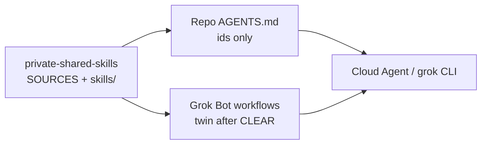

# HLD — Upping our coding game

**Stage 0** · Court track · GitHub-first  
**Repo:** `alexderz/private-shared-skills` (skills home)  
**SDLC lock:** [COURT-SDLC.md](COURT-SDLC.md)  
**Linear:** [Upping our coding game](https://linear.app/derzhi-grok-bot/project/upping-our-coding-game-979b787dfbb9)  
**Alex locks:** ~9:00–9:04pm CT Sat Sep 5 (Stage −1 before HLD; designs on GitHub from onset; Stage 4 loop; CA/grok workers)

## Problem

Court bots need shared, inspectable coding procedures without installing mega-packs (Superpowers / Pocock / Addy whole). Two routers and 6k-token sessions skip the bug. Skills must be cherry-picked, SHA-pinned, Argus-intaken, and twinable into Grok Bot workflows.

## Goals

1. One **skills home** on GitHub with SOURCES pins and court-compressed `SKILL.md` bodies.
2. Thin **AGENTS.md** on product/court repos naming skill **ids** only (no body paste).
3. Role split: Heph forge, Cedalion CI, Argus intake/gates, Themis board.
4. Stage −1 → 0 → … → 7 with **Stage 4 as a loop** until DoD; notify landed+verified.

## Non-goals

- Marketplace `npx skills add` / auto-update upstream.
- Origin-only design docs (Origin may mirror; GitHub is source of truth).
- Reminting closed MERGED skill bodies (#9–#21 wave) without a new Argus cut.
- Bank / Gmail / LastPass / Windows (Alex-pc4) in agent scope.

## Architecture

| Layer | What | Where |
| --- | --- | --- |
| Skills home | Court `SKILL.md` + pins | `alexderz/private-shared-skills` |
| Project contract | Commands + skill ids | Root `AGENTS.md` per product repo |
| Workers | Implement via CA or grok CLI | Remote PR / box Build quota |
| Board | Projects / Epics / Tasks | Linear track above |

## Roles (coding)

| Role | Owner | Boundary |
| --- | --- | --- |
| Architect / delivery | Heph | HLD/LLD, ship, adversarial review |
| Mechanical verify | Cedalion | fmt/lint/CI green, PR watch |
| Security gates | Argus | Intake, Always/Ask/Never, Spector |
| Board | Themis | After-act; does not bless ships |

## Landed (as of ~10:22pm CT Sat Sep 5)

- Stage −1 / layout: PSS Stage 0 dirs, SOURCES, CI fmt-lint, INTAKE
- Skill bodies on main: `tdd`, `verify-before-done`, `pr-review`, `shell-safety`, `security-hardening`, `modern-python`, `golang-testing`, `golang-security`, `golang-safety` (+ Spector hygiene #20)
- AGENTS pilots: PSS inventory; `spending-tracker`; `aws-instance`; `grok-bot-perm`
- Parked Alex: Origin heph-forge #9 COURT-SDLC → #10 AGENTS

## Next cuts (board-ordered)

1. This HLD on GitHub (this file).
2. Thin `yagni` skill or AGENTS restraint bullets (20–40 lines).
3. Optional AGENTS: `claw-metrics` (court-adjacent); defer `skylight-mcp`.
4. Stage 2 LLD only when a concrete product change needs trust-boundary detail.
5. Origin heph-forge #9→#10 when Alex merges in Cursor UI.

## Risks

| Risk | Mitigation |
| --- | --- |
| Board lag vs `gh` | `gh` wins; after-act with America/Chicago timestamps |
| Spector FPs on Never examples | Oblique wording (shell-safety #20 pattern) |
| Dual routers | Ban managed Superpowers; load PSS ids only |
| Empty CA sandbox | Degrade to `gh` forge; do not remint |

## Open questions

- Confirm HLD twin path on Origin heph-forge `projects/upping-coding-game/` after #9 merges (optional mirror; GitHub remains SoT).
- When to mint Linear Epic for Stage 0 HLD Task (Themis).

## References

- [COURT-SDLC.md](COURT-SDLC.md)
- [INTAKE.md](INTAKE.md)
- [SOURCES.md](../SOURCES.md)
- [CHERRY-PICK-CANDIDATES.md](CHERRY-PICK-CANDIDATES.md)
